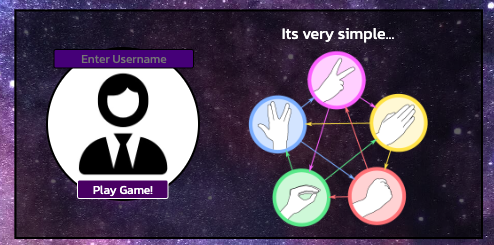

# Rock.Paper.Scissors.Lizard.Spock

Rock.Paper.Scissors.Lizard.Spock (RPSLS for short) is a fun game played to decide on something. Usually, it involves 2 players, however, this online game is played against the computer which selects a choice at random. The original version of 'Rock Paper Scissors' is seen to have too fewer options often presenting a draw. In this game, there are 2 extra options 'Lizard Spock' meaning a winner is more likely.

The site is targeted towards both adults and children looking to make a decision, such as "who drives to the restaurant". The game is more commonly known from the cult TV series 'The Big Bang Theory' therefore it is expected that the game would also attract a large number of these users.

## Existing Features

- Logo/ Title

    * Visible at the top of the page the logo and title allows the user to clearly distinguish the name of the game, and in its simplicity some of the rules, as soon as the page loads.

- Username/ Sign-Up Area

    * Before entering the game area there is a call to action, prompting the user to 'Enter Username' before clicking Play Game. Taking the username creates a better experience during gameplay for the user.

    * Included in this area is an image where the rules are explained very efficiently by using a diagram of which hand wins

- Rules

    * To complement the winning hands image there are some written rules included underneath to further clarify the game rules and winning hands.

- Choice of Hand Buttons

    * Featured throughout the site the interactive buttons are hoverable giving a spin effect and shadow when the users' cursor moves over them. When the user has clicked the 'Play Game' button and entered the game area the buttons then become clickable. When clicked the user's choice is made and the game is played.

- Game Area

    * The game area displays the choice of hand played by both the user and the computer, with the user on the left. On selection by the user, the hands will be shown. A green border is applied to the relevant winner of the round, however when a draw occurs no border is applied to either.

    * Inside the game area the entered username is used to display which hand the user is by taking their input and displaying it above the played hand.

- Scoreboard and Reset Button

    * The scoreboard displays the score incrementing by 1 each game to the winner. If a draw occurs no score is added to either player. The scoreboard also takes the username input and displays it to provide a better experience to the user.

    * Included in the scoreboard is a 'Reset Game' button so the user can, at will, start again.

- Best Of

    * When playing the game a confirmation pop-up is displayed when the combined scores reach 7, 15, or 30. Giving the results and the opportunity to continue playing or reset the game. This provides the user with a set number of possible games to make their decision.

## Features to Implement

-  Another feature to add in the future is another type of game that 2 different users could play. This could be achieved by both selecting a hand but not displaying either until the second user has chosen theirs. Creating a 'user vs user' game.

## Testing

### Lighthouse

A lighthouse analysis was conducted on the site. Giving the following results:

Initially, an issue arose due to low performance, however, it became clear that this was due to an AdBlocker preventing certain elements from loading easily. When switching off the AdBlocker and testing also on a different browser the score dramatically improved.

### Validator Testing

 - HTML
    - Here is a link to the results of the official W3C Validator which returned no errors. [Validated HTML](https://validator.w3.org/nu/?doc=https%3A%2F%2Fmtmanning93.github.io%2FRPSLS%2F)

- CSS
    - Here is a link to the results of the official Jigsaw Validator which returned no errors. [Validated CSS](http://jigsaw.w3.org/css-validator/validator?lang=en&profile=css3svg&uri=https%3A%2F%2Fmtmanning93.github.io%2FRPSLS%2F&usermedium=all&vextwarning=&warning=1)

- JavaScript
    - When validating the Javascript with JSHint the use of **'esversion 6'** must be declared, this comment ( /* *jshint esversion: 6* */ ) must be added above the code in JSHint. Here is a link to the results of the JSHint Validator. [JSHiint](https://jshint.com/)

The following Metrics were returned:
- There are 8 functions in this file.
- Function with the largest signature takes 2 arguments, while the median is 0.
- Largest function has 14 statements in it, while the median is 4.5.
- The most complex function has a cyclomatic complexity value of 17 while the median is 1.

When running the Javascript through the JSHint validator one warning was returned:
> Functions declared within loops referencing an outer scoped variable may lead to confusing semantics.

One 'unused variable' was also returned:
> enterGame

Although enterGame is a function. Research showed that it is possible to suppress this warning in the settings of JSHint or with some extra commented code specific to JSHint.

### Browser Testing

The site has been tested across 4 different browsers: 
- Edge
- Chrome
- Firefox
- Safari. 

A problem occurred when in the final browser, Safari, the background images were not displaying, which caused issues within the JavaScript logic also. To counter this issue the images used had to be converted from webp to jpg format. Once this change was applied the backgrounds were visible across all browsers, and no further issues were detected.

### Screen Testing

The site was also tested across different screen sizes, in both portrait and landscape when possible. 
These screens include:
- Laptop
- Phone
    - iPhone X
    - Samsung Xcover 5
- Tablet
    - iPad
- Desktop Monitor

## Fixed Bugs

### Confirmation Repeat

- To implement a confirmation message which would show after a certain number of games, it required a setTimeout function to ensure it displayed after the scoreboard had changed scores. The original method meant that often and ramdomly it would display twice or more times. To combat this issue the setTimeout function had to be moved from the compareChoice function and instead wrapping the if statement within the bestOf function. This was discovered when removing the original setTimeout function.

### AdBlocker

- After embedding a Youtube video iframe into the site to explain the rules the console would display multiple errors. After extensive research, it was apparent that the issue wasn't being caused by the iframe itself but by the AdBlocker extension which was running in the browser. After removing the AdBlocker no errors appeared. However this meant that users who used an AdBlocker would also see errors. Therfore the video was changed to an explanatory image for better performance.

- The same AdBlocker issue was responsible for poor performance scores when running a Lighthouse Analysis. When turning the AdBlocker off the performance dramatically improved.

## Deployment

- The site was deployed via GitHub pages. The following steps were carried out to deploy the project:
    - In the RPSLS GitHub repository
    - Navigate to the settings tab
    - From the menu on the left select the 'Pages' item
    - Select the Main branch from the branch selection drop-down menu and click save
    - After a few minutes the page can be refreshed leaving the visit site section at the top containing the deployed sites link

The live RPSLS site can be found via this link - [https://mtmanning93.github.io/RPSLS/](https://mtmanning93.github.io/RPSLS/)

## Credits

### Code

- A GitHub repository by author 'Maujor' was used to help create a less verbose 'if else' statement within the 'compareChoice' function (script.js line 80-84) the code can be found at this link [Maujor / rock-paper-scissors-lizard-spock](https://github.com/Maujor/rock-paper-scissors-lizard-spock/blob/master/js/scripts.js).

- The Love Maths walkthrough projects source code was used to create the for loop within the 'enterGame' game function (script.js line 31-34). The source code can be found here [Love Maths](https://github.com/Code-Institute-Solutions/love-maths-2.0-sourcecode/blob/master/05-tidying-up/01-a-few-last-things/assets/js/script.js).

- Instructions on how to implement a 'setTimeout()' delay were taken from [Developer Mozilla](https://developer.mozilla.org/en-US/docs/Web/API/setTimeout).

- Information on implementing a refresh page function was taken from [Stack Overflow](https://stackoverflow.com/questions/5480945/refreshing-page-on-click-of-a-button)

### Content

- Font 'Kanit' and its respective styles were taken from [Google Fonts](https://fonts.google.com/).

- Icons used within the rules section were taken from [Font Awesome](https://fontawesome.com/).

- The Favicon was taken from free content site [Icons8](https://icons8.com/icons/set/favicon).

- The list of rules was taken from [the-big-bang-theory.com](https://the-big-bang-theory.com/rock-paper-scissors-lizard-spock/).

### Media 

- The hands, user and computer icons are from the wireframe created with [Balsamiq](https://balsamiq.com).

- The galaxy background used throughout the site was taken from [Unsplash](https://unsplash.com/photos/E0AHdsENmDg) a free stock image site.

- The guide image relating to the rules was taken from [Seek PNG](https://www.seekpng.com/idown/u2w7w7o0i1t4o0a9_rock-paper-scissors-lizard-spock-rock-paper-scissors/).

